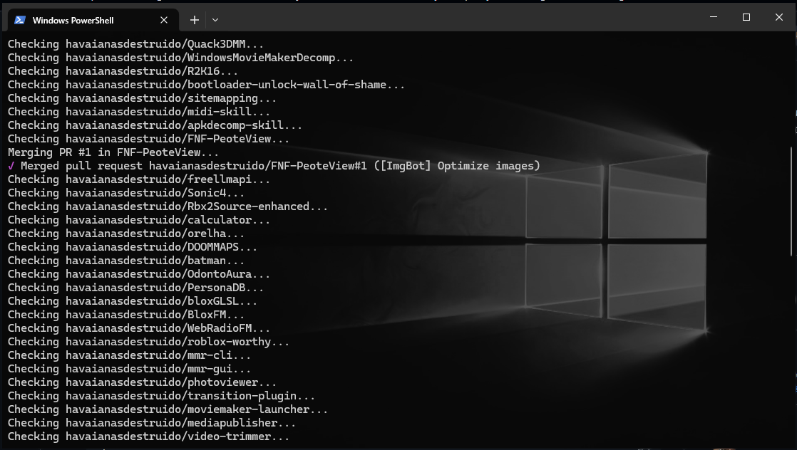

# ImgBotAutomerger

## Star History

<a href="https://www.star-history.com/?repos=havaianasdestruido%2FImgBotAutomerger&type=date&legend=top-left">
 <picture>
   <source media="(prefers-color-scheme: dark)" srcset="https://api.star-history.com/chart?repos=havaianasdestruido/ImgBotAutomerger&type=date&theme=dark&legend=top-left" />
   <source media="(prefers-color-scheme: light)" srcset="https://api.star-history.com/chart?repos=havaianasdestruido/ImgBotAutomerger&type=date&legend=top-left" />
   
 </picture>
</a>


Simple util for automatically merging all ImgBot PRs across all your account.



## How to run it

1. `git clone` this repo, or just download the `.ps1` file.
2. Run it from PowerShell:
   ```powershell
   .\merge.ps1
   ```
3. If you get an execution policy error, run PowerShell as admin once and allow local scripts:
   ```powershell
   Set-ExecutionPolicy -Scope CurrentUser RemoteSigned
   ```

## Notes

- **Confirm the bot name first**: run `gh pr list --repo owner/repo --author imgbot` on one repo to make sure `imgbot[bot]` is the exact author string GitHub expects.
- **`--admin`**: drop this flag if you don't want to bypass branch protection/required checks — merges that fail checks will just error out safely and the loop continues.
- **Org repos**: replace `$USERNAME` with the org name if some repos live under an organization.
